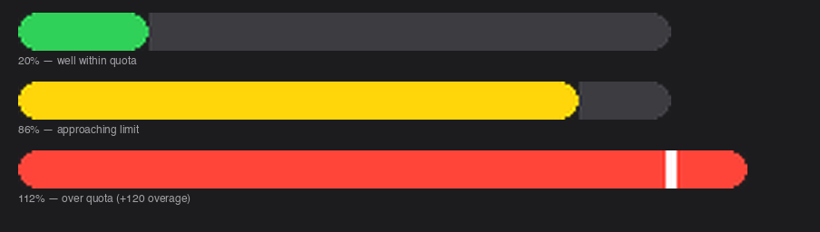

# 🤖 GitHub Copilot Quota Widget

A macOS menu bar widget that mirrors the GitHub Copilot premium request progress bar from your account settings — visible at a glance, always up to date.

**Features:**
- 🟢 / 🟡 / 🔴 color-coded menu bar icon based on usage level
- Pixel-rendered pill progress bar: green/yellow/red for quota consumed, red overage segment extending past the boundary with a white divider
- Resets date + days remaining
- Auto-refreshes every 5 minutes via SwiftBar

---

## What it looks like

**Menu bar (within quota):**
```
🤖 62%
```

**Menu bar (over quota):**
```
🤖 110% ↑
```

**Progress bar scenarios:**



**Full dropdown:**
```
[████████████████████|██████] 110%   ← pixel-rendered pill bar
─────────────────────────────────────
Used:  1,105 / 1,000  (+105 overage)
Resets: 1 Jun  (3d)
─────────────────────────────────────
Updated 8:42 AM
Refresh Now
Open Copilot Settings
```

The `|` marker indicates the 100% quota boundary. The red segment extends past it to show overage proportionally.

---

## Requirements

| Requirement | Notes |
|---|---|
| macOS | Apple Silicon or Intel |
| [gh CLI](https://cli.github.com) | For authentication — `brew install gh` or download from releases |
| [SwiftBar](https://swiftbar.app) | Menu bar host — auto-installed via direct download |
| `python3` | Ships with macOS |
| `curl` | Ships with macOS |

> **Note:** Uses `gh auth token` to authenticate — no credentials stored in the repo or config files.

> **Note:** SwiftBar is downloaded directly from GitHub releases (no Homebrew cask required). Works on MDM-managed machines.

---

## Install

```bash
curl -fsSL https://raw.githubusercontent.com/adam-geipel/copilot-quota-widget/main/install.sh | bash
```

Or clone first (preferred):

```bash
git clone https://github.com/adam-geipel/copilot-quota-widget.git
cd copilot-quota-widget
./install.sh
```

The installer will:
1. Verify `gh` CLI is authenticated
2. Download SwiftBar directly to `~/Applications/` if not already installed
3. Copy scripts to `~/.config/copilot-quota-widget/`
4. Symlink the SwiftBar plugin
5. Run an initial quota fetch

---

## Update

```bash
cd copilot-quota-widget
git pull && ./install.sh --update
```

`--update` re-symlinks files and skips interactive prompts.

---

## How it works

The quota data comes from `https://api.github.com/copilot_internal/user` — the same endpoint the Copilot settings page uses to render the progress bar. Specifically, the `quota_snapshots.premium_interactions` object:

```json
{
  "entitlement": 1000,
  "used": 1105,
  "overage_count": 105,
  "remaining": -106,
  "percent_used": 110.5,
  "quota_reset_date": "2026-06-01T00:00:00.000Z"
}
```

This is fetched via your existing `gh` CLI session token — no extra OAuth scopes required.

The progress bar is a PNG rendered on the fly via Pillow (installed into a local venv at `~/.config/copilot-quota-widget/.venv` on first run) and embedded as a base64 `image=` parameter in the SwiftBar menu item.

> **Note on enterprise plans:** Enterprise seats often have `unlimited: true` for chat/completions but still have a `premium_interactions` entitlement (e.g. 1000/month). The widget handles both cases — unlimited quotas show `∞` rather than a progress bar.

---

## File layout

```
~/.config/copilot-quota-widget/
├── fetch_quota.sh          # fetches API → writes quota.json
├── copilot-quota.5m.sh     # SwiftBar plugin (5-min auto-refresh)
├── quota.json              # cached quota data (auto-written)
├── quota_error.txt         # written on fetch failure, cleared on success
└── .venv/                  # Python venv with Pillow (auto-created on first run)
```

---

## Troubleshooting

**Menu bar shows `🤖 !`**
- Click the icon — the error message is shown in the dropdown
- Most common: `gh` CLI not authenticated → run `gh auth login`

**Data looks stale**
- Click `Refresh Now` in the dropdown
- Check `~/.config/copilot-quota-widget/quota_error.txt` for fetch errors

**`quota_snapshots` is missing**
- This endpoint is `copilot_internal` — GitHub may change it without notice. Open an issue if the schema breaks.

---

## License

MIT
